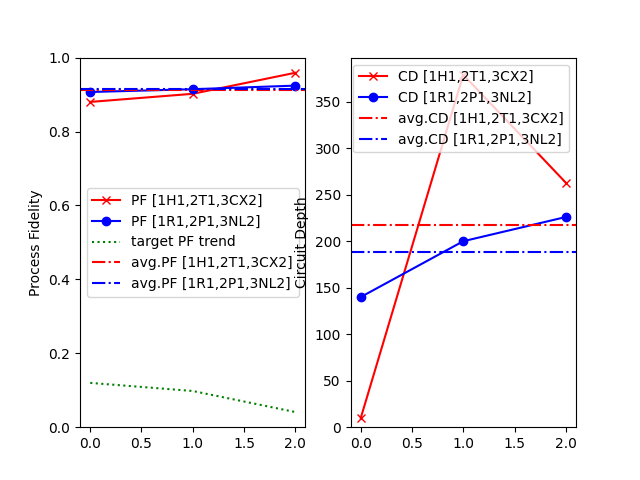

# Yet Another Quantum Quantizer

[](https://www.gnu.org/licenses/agpl-3.0)
[](https://badge.fury.io/py/yaqq)
[](https://yaqq.readthedocs.io/en/latest/?badge=latest)
[](https://doi.org/10.5281/zenodo.5738685)

The standard model of quantum computation is based on quantum circuits, where the number and quality of the quantum gates composing the circuit influence the runtime and fidelity of the computation. The fidelity of the decomposition of quantum algorithms, represented as unitary matrices, to bounded depth quantum circuits depends strongly on the set of gates available for the decomposition routine. To investigate this dependence, we explore the design space of discrete quantum gate sets and present a software tool for comparative analysis of quantum processing units and control protocols based on their native gates. The evaluation is conditioned on a set of unitary transformations representing target use cases on the quantum processors. The cost function considers three key factors: (i) the statistical distribution of the decomposed circuits' depth, (ii) the statistical distribution of process fidelities for the approximate decomposition, and (iii) the relative novelty of a gate set compared to other gate sets in terms of the aforementioned properties. The developed software, called YAQQ (Yet Another Quantum Quantizer), enables the discovery of an optimized set of quantum gates through this tunable joint cost function. To identify these gate sets, we use the novelty search algorithm, circuit decomposition techniques (like Solovay-Kitaev, Cartan, and quantum Shannon decomposition), and stochastic optimization to implement YAQQ within the Qiskit quantum simulator environment. YAQQ exploits reachability tradeoffs conceptually derived from quantum algorithmic information theory. Our results demonstrate the pragmatic application of identifying gate sets that are advantageous to popularly used quantum gate sets in representing quantum algorithms. Consequently, we demonstrate pragmatic use cases of YAQQ in comparing transversal logical gate sets in quantum error correction codes, designing optimal quantum instruction sets, and compiling to specific quantum processors.

### Citation:
If you find the repository useful, please consider citing:

```
@misc{YAQQ,
  author={Sarkar, Aritra and Kundu, Akash},
  title={YAQQ: Yet Another Quantum Quantizer},
  howpublished={\url{[https://github.com/Advanced-Research-Centre/YAQQ](https://github.com/Advanced-Research-Centre/YAQQ)}},
  year={2023}
}
```

or our article:
```
@article{sarkar2024yaqq,
  title={YAQQ: Yet Another Quantum Quantizer - Design Space Exploration of Quantum Gate Sets using Novelty Search},
  author={Sarkar, Aritra and Kundu, Akash and Steinberg, Matthew and Mishra, Sibasish and Fauquenot, Sebastiaan and Acharya, Tamal and Miszczak, Jaros{\l}aw A and Feld, Sebastian},
  journal={arXiv preprint arXiv:2406.17610},
  year={2024}
}
```


### How to use:

#### User version:

1. `pip install --upgrade yaqq`
2. In a Python program, 
```
from yaqq import yaqq
```
##### Manual mode
```
qq = yaqq()
qq.yaqq_manual()
```
##### API mode
```
qq = yaqq()
qq.yaqq_cfg(<CONFIG_FPATH_FNAME>)
```

#### Developer version:
1. Install dependencies listed in `requirements.txt`
2. Navigate to `dev` folder
3. `>> python yaqq.py`


### Usage modes (to be updated):

The first user menu choice is to either enter the `manual mode` or the `developer mode`. The developer mode is for testing certain features during development, and is a hardcoded shortcut for a specific selection of the manual mode. We recommend going into the former to access the full functionality of YAQQ.

The next choice is of the data set. Currently YAQQ only supports 1 qubit operations. The number of data points determines the runtime of the search, and the precision level for testing the gate sets on the Hilbert space. We have tested in orders of around 20 points.

The data set is of 3 types: (a) `equispaced points` on the Bloch sphere (pure states on 1 dimensional Hilbert space) generated by a golder ratio rotation on the spherical coordinate, (b) `Haar random pure states`, (c) `Haar random unitaries`. While the first two generated states, the later generated unitaries. All 3 types are stored as unitaries. For the first two, it denotes the unitary to transform from the |0> state. The later 2 should give similar result, as in principle, a Haar random unitary on any state (including the |0> state) is a Haar random state. We recommend using the first option, as it guarantees that the fidelity is bounded.

The data set can be visualized on the Bloch sphere. The unitary matrices in the data set are plotted as the target state when applied on the |0> state. The colours denote the x,y,z cartesian coordinate values.

Next, one needs to select the decomposition method. This can be either the `Solovay-Kitaev decomposition`, or a `Random decomposition`. While the Solovay-Kitaev theorem (SKT) guarantees that a small decomposition exist with bounded error, it is often hard to search that decomposed circuit, and in practise we found the random method to be more scalable.

The YAQQ operates in 2 modes: (a) it can `compare` two gate sets hardcoded based on the data set and decomposition method, (b) it can `generate` a novel complementary gate set based on the data set and decomposition method. The later option forms the core functionality of YAQQ. The former is mostly for generating further insights of already known gate sets.

If the generate mode is selected, the user has a further choice of the method used to search the space of gate sets. We currently support 2 methods: (a) `random` search, where new Haar random unitaries are used as gate set and their expressive power is evaluated, (b) an `optimization` routine finds the configuration for single qubit generalized rotation gates to form the gate set. 

### Usage Example (from configuration file):

#### Configuration File

configs\NUSA_eid-0006.cfg

```
[general]
    exp_name = NUSA
    exp_id = 0006

[experiment]
    yaqq_mode = 1
    yaqq_cf_dcmp_gs1 = [1,2,2]
    yaqq_cf_dcmp_gs2 = [1,2,2]

[mode1]
    yaqq_ds_dim = 1
    yaqq_ds_type = 2
    yaqq_ds_reso = 16
    yaqq_ds_size = 3
    yaqq_ds_show = N
    yaqq_cf_wgts = [50,1,1,1,1]
    yaqq_cf_gs1 = H1,T1,CX2
    yaqq_cf_ngs = R1,P1,NL2
    nus_max_time = 60
    optimize = Y
    opt_max_iter = 500

[result]
    plt_pfivt = Y
    yaqq_plt_save = Y
```

#### Execution

```
(env) [path]>python yaqq.py

_____________________________________________________________________

           Welcome to YAQQ: Yet Another Quantum Quantizer.

Copyright © 2023 Quantum Intelligence Research Group; AGPL v3 License

  Code repository: https://github.com/Advanced-Research-Centre/YAQQ
_____________________________________________________________________

  ===> Run from Configuration File? [Y/N] (def.: Y): Y

  ===> Enter Configuration Filename (e.g.: NUSA_eid-0006): NUSA_eid-0006

  ===> YAQQ Data Set Generated for Dimension = 1, Type = 2, Size = 3

  Decomposing Data Set into Gate Set 1:[1H1,2T1,3CX2]

100%|█████████████████████████████████████████████████████████████████████████████████████████████| 3/3 [00:07<00:00,  2.33s/it] 

  Decomposing Data Set into Gate Set 2, trials = 1

1R1 Instruction(name='unitary', num_qubits=1, num_clbits=0, params=[array([[-0.40623416-0.72835851j,  0.53061472-0.15137933j],
       [-0.50324576+0.22629933j,  0.15892188+0.81870395j]])])
2P1 Instruction(name='unitary', num_qubits=1, num_clbits=0, params=[array([[-0.13734808+0.j        ,  0.17919774-0.97417846j],
       [-0.99019932-0.02531439j, -0.02829207+0.13440258j]])])
3NL2 Instruction(name='unitary', num_qubits=2, num_clbits=0, params=[array([[0.36541038+0.59277413j, 0.        +0.j        ,
        0.        +0.j        , 0.61094735-0.3766131j ],
       [0.        +0.j        , 0.14533008-0.2357566j ,
        0.81795883+0.5042235j , 0.        +0.j        ],
       [0.        +0.j        , 0.81795883+0.5042235j ,
        0.14533008-0.2357566j , 0.        +0.j        ],
       [0.61094735-0.3766131j , 0.        +0.j        ,
        0.        +0.j        , 0.36541038+0.59277413j]])])
[1.08771578 1.0081358  0.55790501 0.15587061 0.66548127 0.64831789]

_____________________________________________________________________

--------------------- Thank you for using YAQQ. ---------------------
_____________________________________________________________________
```

#### Results

The following files hold the raw data:
 * results\data\NUSA_eid-0006_2024-01-08-11-12cd1.npy (circuit depths using gs1)
 * results\data\NUSA_eid-0006_2024-01-08-11-12cd2.npy (circuit depths using gs2)
 * results\data\NUSA_eid-0006_2024-01-08-11-12gs1.npy (unitaries for gs1)
 * results\data\NUSA_eid-0006_2024-01-08-11-12gs2.npy (unitaries for gs2)
 * results\data\NUSA_eid-0006_2024-01-08-11-12pf1.npy (process fidelity using gs1)
 * results\data\NUSA_eid-0006_2024-01-08-11-12pf2.npy (process fidelity using gs2)

The visual comparison of the gate sets is stored in:
 * results\figures\NUSA_eid-0006_2024-01-08-11-12.pdf
 * results\figures\NUSA_eid-0006_2024-01-08-11-12.png (shown below)



### Example run (to be updated):

```
(env) [path]>python yaqq.py

  ===> Run Default Configuration? [Y/N] (def.: Y): N

  ===> Enter Data Set Size (def.: 500): 20

  ===> Choose Data Set:
   Data Set 1 - Evenly distributed states (using golden mean)
   Data Set 2 - Haar random states
   Data Set 3 - Haar random unitaries
   Option (def.: 1): 1

  ===> Visualize Data Set? [Y/N] (def.: N): Y 

  ===> Choose Gate Decomposition Method:
   Method 1 - Solovay-Kitaev Decomposition
   Method 2 - Random Decomposition
   Option (def.: 2): 2

  ===> Choose YAQQ Mode:
   Mode 1 - Compare GS2 (in code) w.r.t. GS1 (in code)
   Mode 2 - Generative novel GS2 w.r.t. GS1 (in code)
   Option (def.: 2): 2

  ===> Choose Search Method:
   Method 1 - Random Gate Set Search
   Method 2 - U3 Angles SciPy L-BFGS-B/COBYLA with Multiple Random Initialization
   Option (def.: 1): 1

100%|██████████████████████████████████████████████████████████████████████████████████████████████████████████████████████████████████████████████████████████████████████████████████████████████████████████████| 20/20 [05:57<00:00, 17.85s/it]

Best settings found: {'U1': Instruction(name='unitary', num_qubits=1, num_clbits=0, params=[array([[ 0.16679561+0.66638905j, -0.48916454+0.53742247j],
       [-0.5800487 -0.43777662j, -0.04078379+0.68573451j]])]), 'U2': Instruction(name='unitary', num_qubits=1, num_clbits=0, params=[array([[ 0.23548325-0.07821723j,  0.94889751+0.19499543j],
       [-0.24920145+0.93612411j,  0.17513029-0.17578304j]])]), 'U3': Instruction(name='unitary', num_qubits=1, num_clbits=0, params=[array([[ 0.07294652-0.27161266j,  0.78939184-0.5456793j ],
       [-0.61955656+0.73284039j,  0.27740004-0.04630173j]])])}

Plot data? [Y/N] (def.: Y): Y
Save plots and data? [Y/N] (def.: N): N

Thank you for using YAQQ.
```

The plot of the data set:


The plot of the performance of the novel gate set with respect to [H, T, Tdg]. As we can see, we found a gate set (the unitary matrices of which are in the results above) that has higher fidelity and lower depth for expressing the data set.:


### Contributing:
Feel free to report issues during build or execution. We also welcome suggestions to improve the performance and features of this application.

### Influenced by:
1. [RuliadTrotter: meta-modeling Metamathematical observers](https://community.wolfram.com/groups/-/m/t/2575951)
2. [Visualizing Quantum Circuit Probability: Estimating Quantum State Complexity for Quantum Program Synthesis](https://www.mdpi.com/1099-4300/25/5/763)
3. [Automated Quantum Software Engineering: why? what? how?](https://arxiv.org/abs/2212.00619)
4. [Discovering Quantum Circuit Components with Program Synthesis](https://arxiv.org/abs/2305.01707)
5. [Automated Gadget Discovery in Science](https://arxiv.org/abs/2212.12743)
6. The YAQQ name is inspired by the [YACC](https://en.wikipedia.org/wiki/Yacc) - a compiler-compiler, or a compiler-generator. In a similar way YAQQ provides the set of decompositions for the generated gate set.

### Development plans:
- [ ] Use Boran's KetGPT as a dataset
- [ ] See if tradeoff exists between gate set size and 2 scores
- [ ] Plot gate set as points on [Weyl chamber](https://weylchamber.readthedocs.io/en/latest/tutorial.html), e.g., HxI, IxH, TxI, IxT, CX
- [ ] Equispaced states in higher dimension Hilbert space (under some distance measure)
- [ ] "Research and justify" cost function to optimize for choosing complimentarity, based on distribution of 2 scores on all mesh points (e.g. KL-div, JS-div, cross entropy)
- [ ] Solovay Kiteav decomposition of number of qubits > 1 
- [ ] General 2 qubit gate with 15 free parameters
- [x] Use [setuptools](https://setuptools.pypa.io/en/latest/userguide/quickstart.html), [twine](https://twine.readthedocs.io/en/stable/index.html) for PyPI
- [x] Allow biased resource score, i.e. each gate in set can have a different cost (e.g., runtime on a QC)
- [x] Allow tuning hyperparameters of cost function
- [x] Find two U gates in an overspecified gate set (u1,u1dg,u2,u2dg) such that it beats (h,t,tdg) in either of the 2 scores
- [x] Use U3 to produce points for benchmarking
- [x] Try different SciPy optimizers
- [x] Plot "fidelity score" and "resource score"
- [x] Compare distribution of standard (h,t,tdg) and (h,t,tdg) generated via custom U; if same, eliminate standard gate definitions, use only custom U
- [ ] PySimpleGUI (stall: current menu is extensive and self-explanatory with article)
- [ ] Map projections for Bloch sphere (stall: focus more on n-qubit data sets)
- [ ] Bloch sphere states using hierarchical hex mesh (e.g. [H3: Uber's Hexagonal Hierarchical Spatial Index](https://github.com/uber/h3)) (stall: focus more on n-qubit data sets)
- [ ] Plot fidelity/depth difference with colour on Bloch sphere like VQCP L/T topology (stall: focus more on n-qubit data sets)


